<h1 align="center">Trick That Though</h1>

Live website :arrow_down: 
<a href="https://trick-that-though.herokuapp.com/">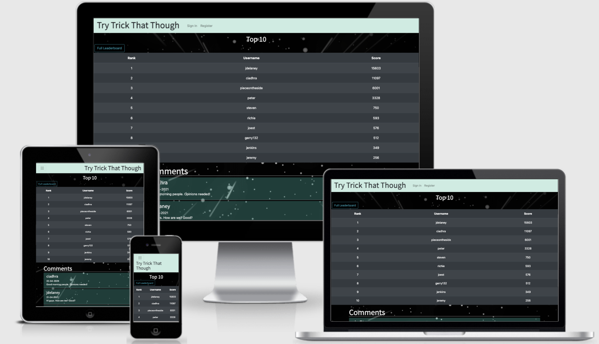</a>

## About

Having looked online for examples of flask games, none could be found so I decided to see if I could programme one myself, without the use of JS. This webapp is possibly the only example of a flask/jinja game and (also possibly) the only representation of 4d tic-tac-toe on one board. This 'look mom, no JS!' website is an example of what can be done to create front-end interactivity with just html, css and python with flask. The game uses innovative methods, to solve for win scenarios and create, dumb, computer opposition. In the future I plan to use this method to allow for online mutliplayer playing, implemented using a rest-api.

## User Stories

- The Avid Gamer

  - I expect to be able to have an enthralling experience gaming.
  - The website should allow me to play quickly and easily with little loading/buffering.
  - I expect there to be a competetive element and for there to be a learning curve and a difficulty that requires surpassing.

- The Casual Gamer

  - I expect to be able to play quickly and easily as a priority.
  - The game should have an intermediate difficulty and an easy option.
  - I expect to be engaged and kept interested while I waste some time playing the game.

- A Younger, Older or Noob Gamer

  - The website should be clear and easy to use and understand.
  - I expect there to be a community of players and administrators to provide feedback about the game.
  - There should be instructions on how to use the game and they should be thurough.
  - I expect to be given an easy playing option.

## Design and Creation

For this project I had initially intended on creating an online multiplayer game but, in the end, ran out of time to implement the rest api to support this feature and had to settle for a local game to be played against the computer or a friend on the one device.
 
 
Tic-tac-toe had occured to me as being the easiest to create and one which would be ideal as a proof of concept. The addition of higher dimensions came as I developed the vector method for solving the game. This method allowed me to up the dimensions easily without adding much complexity to the code. I was also forced to use this method as I didn't want to use JS and flask could only return coordinates.
 
 
I wanted to create a 3D board that could be generated by jinja based on parameters set by the user. The jinja for loops take the width and number of dimensions set by the user and generate the appropriate board. The css which gives perspective is determined by the iteration of the for loop; pieces that were layed out in early iterations will be smaller than those layed out in later iterations, giving the desired 3D effect.
 
 
The aesthetic I opted for is a space theme. I thought this fit the multidimensionality of the game and added to the games mystique in being a novel game which the user would never have seen before. The game can be branded as an 'outer space' version of tic-tac-toe.
 
 
Some difficulty lay in making the layout intuitive to understand in its representation of 4 dimensions. I opted for sections of squares with pointed squares on either end to signify the fourth dimension corners and edges. To explain, there are 2 4D corners per 3D corner and 2 4D edges per 3D edge and with the inner sections and face sections there are 2 4D end points within each section. This was the best way I could think of representing 4D tic-tac-toe in a 3D grid. I have to admit that it does require explanation but there are few 4D concepts which don't, if the fourth dimenion is physical. I believe this design achieves the best possible way of making higher dimensional tic-tac-toe intuitive.

### The Solution Function

The traditional method of checking for a win scenraio would be by checking each row, column and diagonal after each go and if all sections of one are full with either an X or an O, or red or blue, then there would be a victory for that user. This allows for an easy computation for a computer opponent also. The computer would fill a remaining space if the rest were filled with the users mark.
 
 
Using coordinates instead meant that vectors were needed to create lines which could be completed. When a coordinate is submitted by a user it is cross referenced against all previous coordinates inputted by the user and if it could exist on a line with that coordinate to form a run it is added to a list of potential runs. It is also cross referenced against all potential runs that have been collected by that function. If the number of coordinates in a potential run equals the width of the board then there is a victory.
 
 
The computer can block the user by completing a potential run of the opponent. If the computer sees that there exists a potential run that is equal to the width of the board minus one then it will submit the remaning coordinate that would complete that run. If a run of such length does not exist then the computer will play randomly. This behaviour of the computer makes it easy enough to beat but requires some setting up.
 
 
This method, I derived myself, uses something akin to symmetric vectors and I could not find anything similar, anywhere online, so perhaps I can say it is a first for this method to be used to solve tic-tac-toe. It is ideally suited for multidimensional tic-tac-toe as not much tweeking of the function is required as dimensions are added. This project serves as a proof of concept for this method and as a demonstration of what can be achieved on the front-end with just python and flask.

## Mockups

* ### Mobile

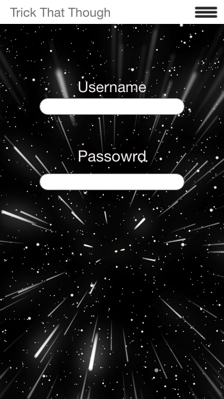
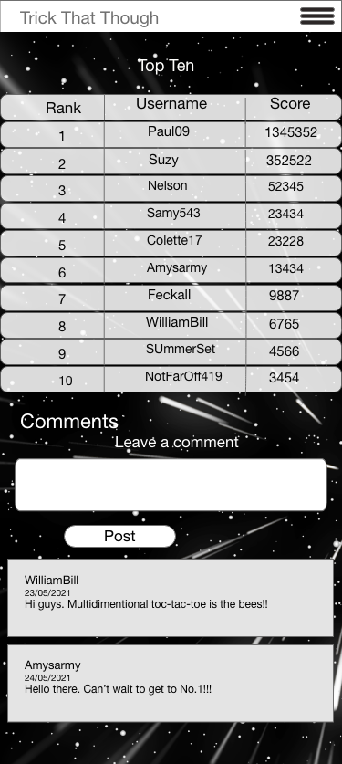
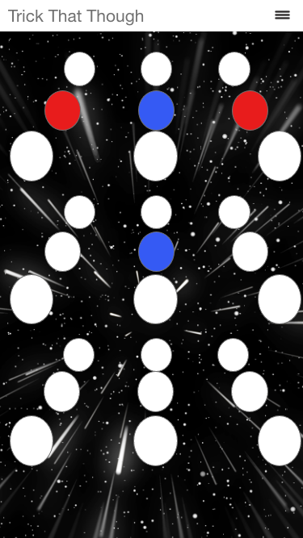

* ### Tablet

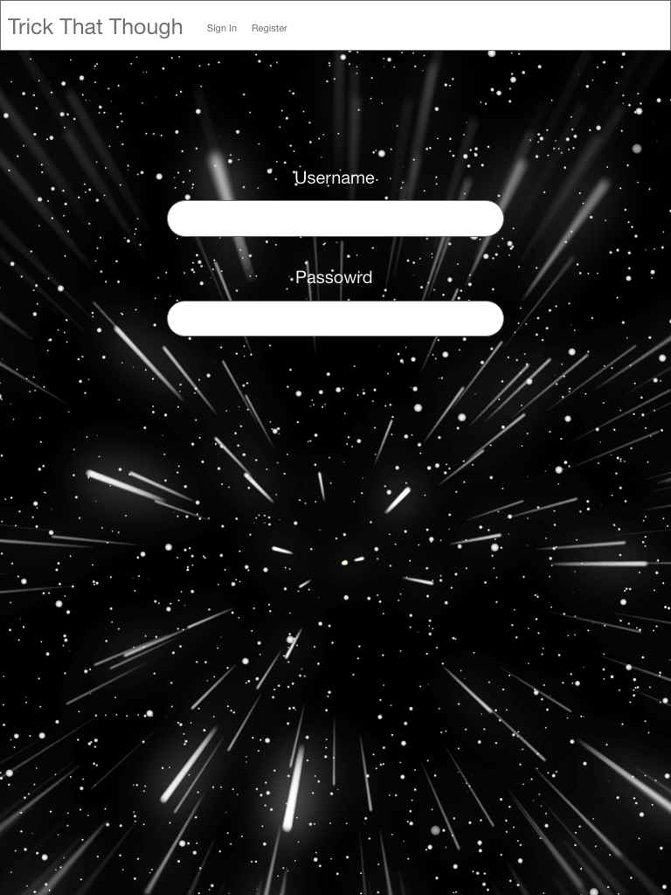
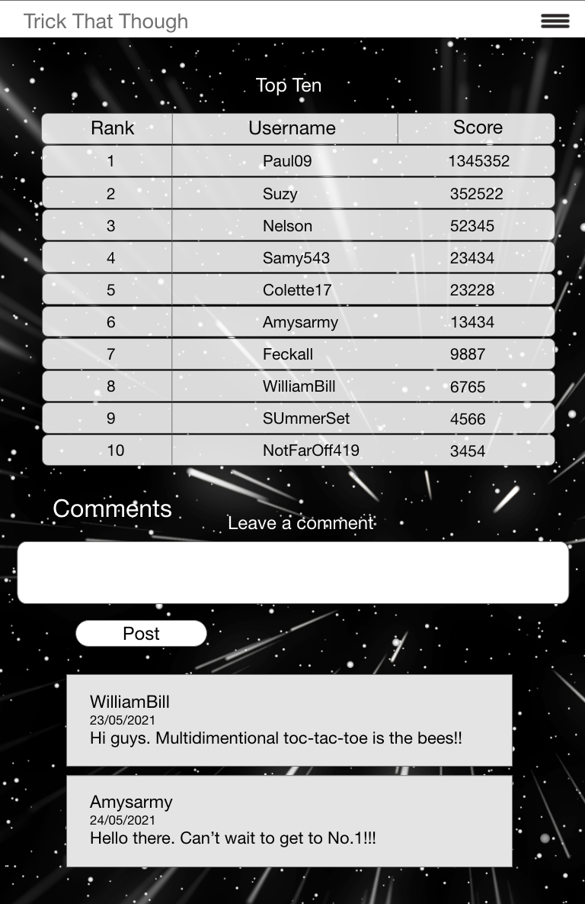
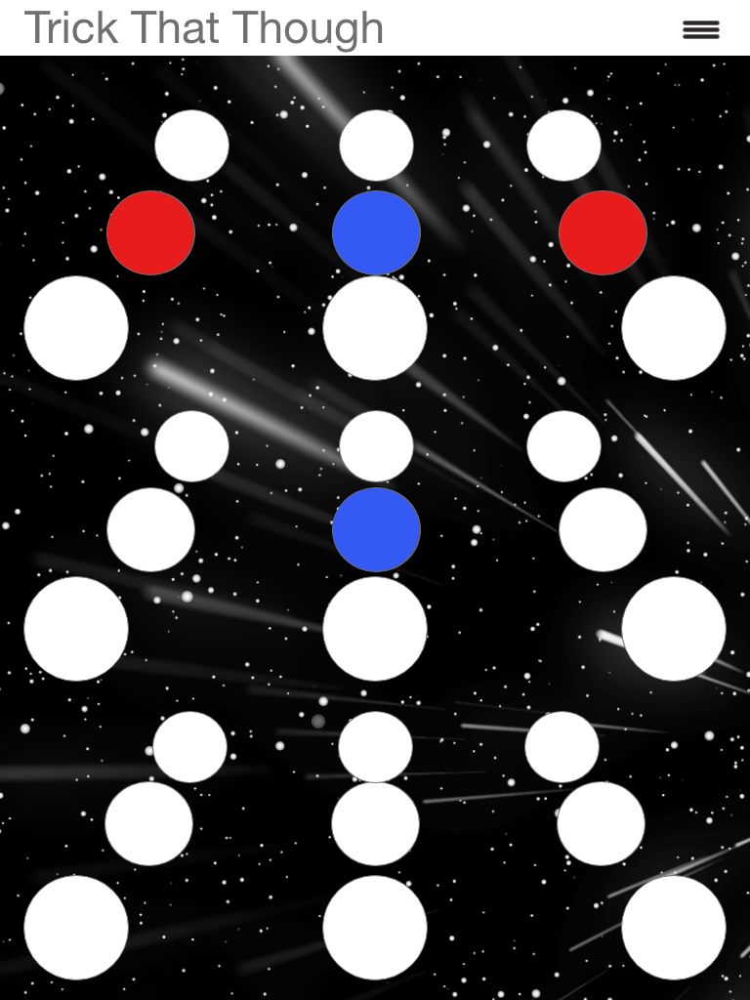

* ### Desktop

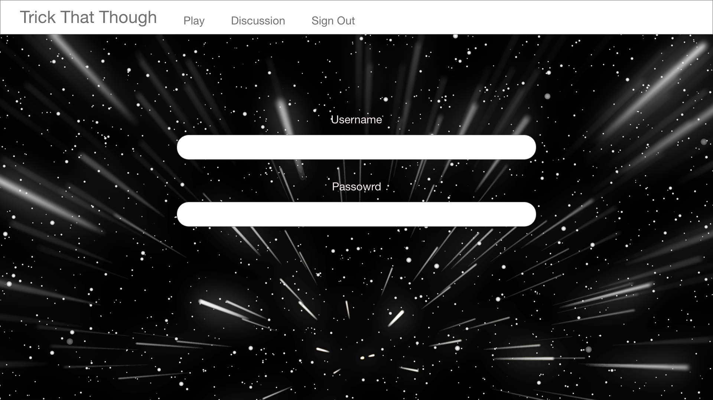
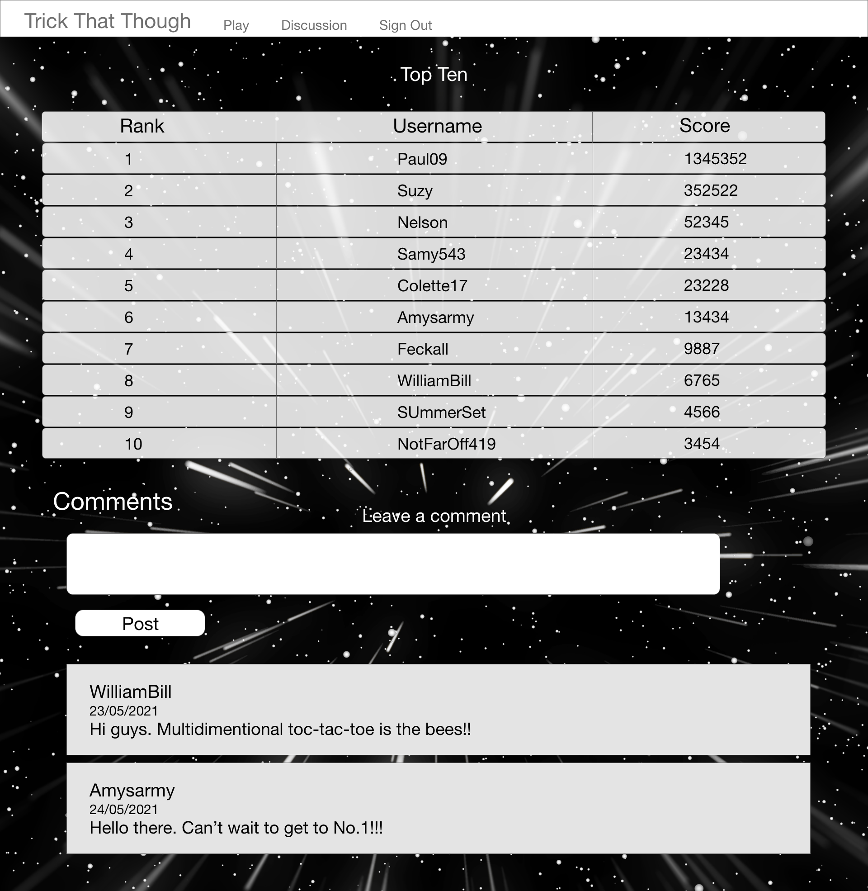
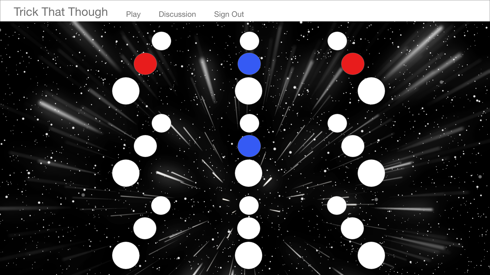

## Features

* ### Sign In and Register Pages

    - These pages are quite simple and I didn't want to distract from the overall intention behind these pages which is to get the user to register or sign in. The user gets a feel for the website's theme with the space background whcih is present throuhgout the website. I have added two boxes either side of the input fields which are a shape found on the game board. This is a motif which is a thread to tie together the beginning of the user experience to the end and also the beginning and end of a section in the game.

* ### Discussion Page

    - This page contains all the relevant information for a user to see how they fare compared with other users and to be able to discuss this and features and quirks of multidimensional ti-tac-toe.
    - The page starts with a top 10 leasderboard and a button to allow you to view the entire leaderboard. This is to get the user interested in playing the game more to improve their own score.
    - The Page provides the user with a commenting function. I wanted to create a community which could discuss the quirks of the game and have some banter about positions on the leaderboard.
    - The user can edit or delete any comment they have made and the comments are displayed in chronological order so that the most recent comments are displayed at the top. Any new user can get the latest in the discussion.

* ### Games Page

    - The game page provides the user with an initial welcome message and a provocative 'let's play'.
    - The user is given the settings options to setup the board properties and these are presented to the user in the form of select inputs so the user doesn't have to type.
    - When the user has chosen a set of parameters and an opponent they can press the 'play' button and begin playing.

## Technologies Used

### Languages Used

-   HTML5
-   CSS3
-   JavaScript
-   Python3
-   flask
-   MongoDB

### Frameworks and programmes used

- Gitpod was the IDE used to code the website.
- AdobeXd for the design of the mockups.
- Vectr to edit images.
- TnyJPG to compress images.
- Googles Fonts
- Git
- GitHub
- jQuery

### MongoDB

I used MongoDB for the database. It allows you to set up a database with collections which store your data as documents, in JSON format. I set up two collections. One for the users and another for the comments.
 
 

#### The user collection
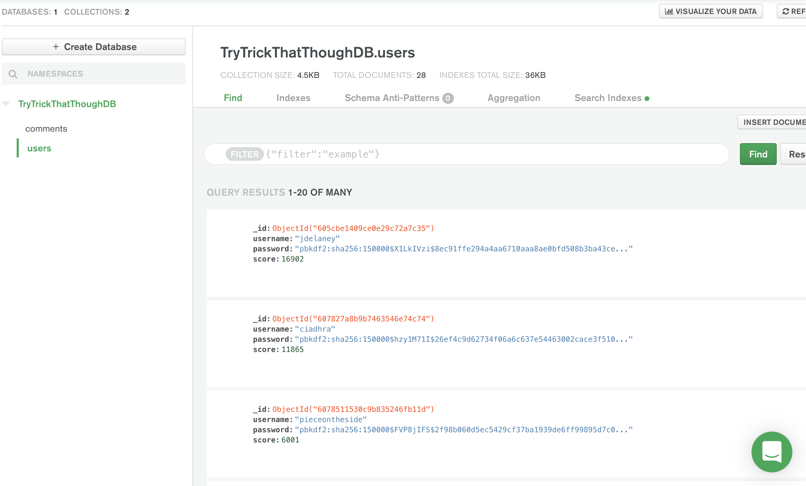

- This collection stores the users' usernames, passwords and score. A user's username and password would be set when they register and their score will be begin at 0.
- A user's score is updated each time they win a game, the score is calculated by taking the width and setting it to the power of the number of dimenions (width**dimensions). Their score is retrieved amd then the winning score is added on to that figure and then the database is updated with the new score replacing the old one. This uses the find_one and update_one pymongo operations.
- The leaderboard retrieves and displays the users in order of highest scoring. This requires the find() and sort operations which take the entire collection and sorts it with respect to a property and in an ascending or descending order (1, -1).

#### The comments collection
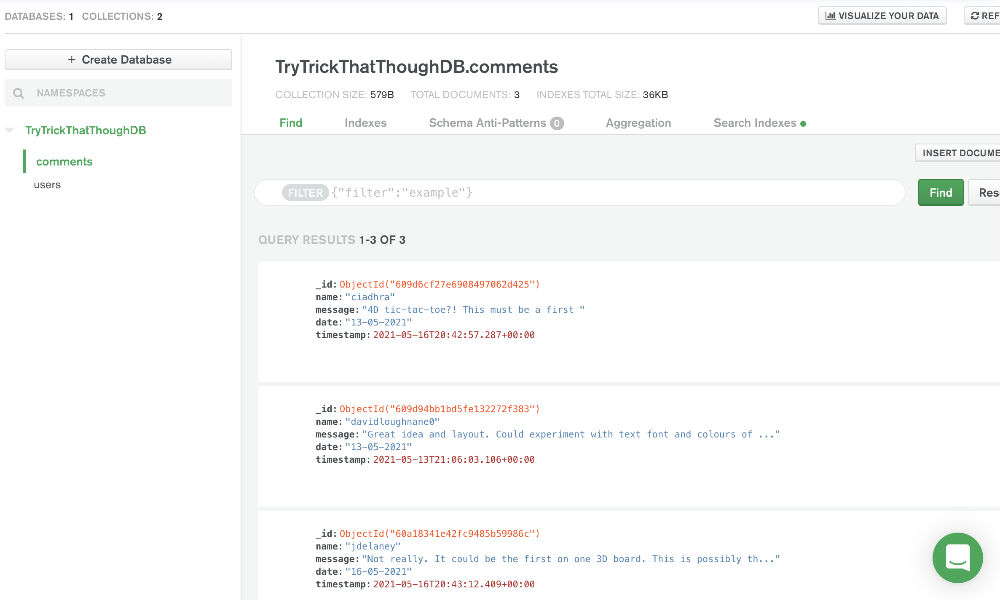

- This collection stores the comments made by registered users in the discussion page. The comments are stored with the name being the username, the message being the comment, and the date of the message being posted in dd,mm,yy format, along with a timestamp, in ISO format, which will reflect the last time the message was edited or just the date it was posted if no editing occurs.
- The comments are subjected to full CRUD operations. The user can write a comments, read comments, edit their comments and delete them.
- When a comment is written and posted the code executes an insert_one operation with a dictionary containing the aforementioned properties.
- The page will display the existing comments by using the find() and sort operations it will get them and arrange them in order of most reently posted/edited, using the timestamp.
- A user can edit their comments and this will invoke the update operation after flask retrieves the updated message, and the comment is found using the object id.
- Finally a comment can be deleted by the user who posted it. This uses the remove operation on the document, targeted using the object id.

## Testing

### Known Bugs

On mobile devices the user may have to zoom in, in order to play in the correct section. I did not want to disable the option of playing the 4D tic-tac-toe on smaller screen sizes as the user can still play, albeit with greater difficulty than on a desktop or tablet. The entire premise behind the 4 dimensional tic-tac-toe would be lost to all those playing on mobile devices.
 
 
All users can play the game on any sized device if they wish, I want every user to be able to enjoy the 4D experience, at home or on the go.
 
 
 
Another feature which could be seen as a bug is the movement back up to the top of the page after the user plays. This is unavoidable given I am only using flask and jinja on the front-end and would require the use of Ajax to solve. I haven't learned Ajax and have not had the time to for this project but may do in the future and return to this project to remedy this bug.

### User experience

- Friends, family and peer review testing.

    - I asked friends and family of all different ages and abilities to play around with the website and explore its features. No issues were found in the final round of testing.
    - The design of the game board was influenced by the feedback I received during this phase of testing. The lines either side and the definition of each plane along with other minor style features were added to the game off the back of feedback received.

- The Avid Gamer

  - <em>I expect to be able to have an enthralling experience gaming.</em>
    - The game has an exciting aesthetic with the space theme and 3D effect and engages the user with the potential to climb the leaderboard and compete with other players from around the world.
  - <em>The website should allow me to play quickly and easily with little loading/buffering.</em>
    - Once a player has signed in/registered they are redirected straight to the game page where they need waste no time in getting down to playing. The game's backend I have programmed to run and load as quickly as possible and should give the user a seemless experience.
  - <em>I expect there to be a competetive element and for there to be a learning curve and a difficulty that requires surpassing.</em>
    - The leaderboard is there to give the users the drive to continue playing and to provide them with this competetive element. The game itself has a range of difficulty which is inherent in the width and dimensionality of the board. The computer provides the user with ample resistance to force them to strategise.

- The Casual Gamer

  - <em>I expect to be able to play quickly and easily as a priority.</em>
    - The redirection from the sign-in to the game page is to satisfy this demand which every kind of user is likely to have. The game set-up board does not require the user to type anything in and if they wish they can just press play without changing anything and be thrown straight into a game.
  - <em>The game should have an intermediate difficulty and an easy option.</em>
    - The default select options are an intermediate level difficulty set-up. The user can change this and during a game can quickly opt out of the game if they'd like to change the board settings. The instructions modal gives the user information on the difficulty of different set-ups.
  - <em>I expect to be engaged and kept interested while I waste some time playing the game.</em>
    - The aesthetics, the competition put up by the computer, and the novelty of a new game should make for some engaging playtime. A new game like this will present a learning curve but the features mentioned above should make learning an enjoyable process. The short game format will give the user a quick bout of enjoyment and does not require a large investment of time.

- A Younger, Older or Noob Gamer

  - <em>The website should be clear and easy to use and understand.</em>
    - The simple layout of the navigation and redirection from sign-in will make the navigating easy for the user. The instructions on the game page will provide the noob with enough reading to be able to grasp the concept of how to play 4D tic-tac-toe. The 3D and width of 3 options will make for a very easy introductory level game which this kind of player to enjoy getting started.
  - <em>I expect there to be a community of players and administrators to provide feedback about the game.</em>
    - The discussions page provides the user with a platform to air their opinions, tips, questions and responses. The administrators of the website can monitor the activity and address any queries that users may have if other users haven't. The edit and delete options also allow them to backtrack or change the wording of their questions if necessary.
  - <em>There should be instructions on how to use the game and they should be thurough.</em>
    - The instructions give the user a description of how to play the 4D tic-tac-toe. The pictures provided and the details at the beginning are all a user should need to get started playing higher dimesnional tic-tac-toe. The images give an example of most kinds of possible winning runs that can be achieved and should give them all the info they need without telling them how to beat the computer or explain too much and take away from the challenge the game should present.
  - <em>I expect to be given an easy playing option.</em>
    - When the user changes the settings to 3 dimensions with a width of 3 as per the instructions on which settings are the least difficult, they will be given the easiest possible board set-up to almost guarantee them a win if they make even the slightest effort. The user can then increase the width and dimensionof the board to increase the difficulty.

### Performance Testing

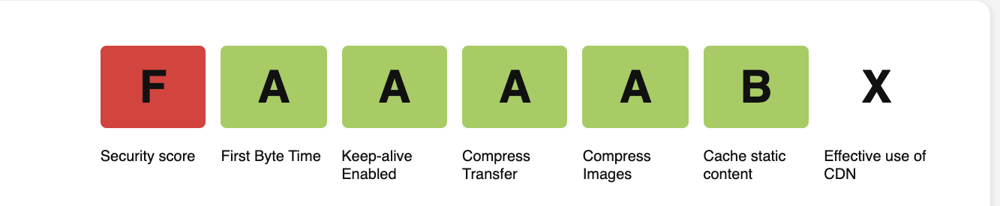
Testing of the webpage was carried out using <a href="https://www.webpagetest.org/">webpagetest.org</a>
 
 
The CSS validating was done using <a href="https://jigsaw.w3.org/css-validator/">W3</a> 
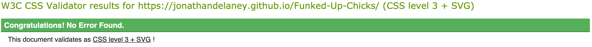
 
 

HTML Test:

 - Sign In and Register pages - Pass
 - The Discussion Page - Pass
 - The Game page -Pass

### Compatibility Testing
- Browser Compatibility

    | Screen size\Browser | Safari           | Opera            | Microsoft Edge   | Chrome           | Firefox          | Internet Explorer |
    | --------------------|:----------------:|:----------------:|:----------------:|:----------------:|:----------------:|:-----------------:|
    | Mobile              |:heavy_check_mark:|:heavy_check_mark:|:heavy_check_mark:|:heavy_check_mark:|:heavy_check_mark:| Not Tested        |
    | Desktop             |:heavy_check_mark:|:heavy_check_mark:|:heavy_check_mark:|:heavy_check_mark:|:heavy_check_mark:| Not Tested        |
    | Tablet              |:heavy_check_mark:|:heavy_check_mark:|:heavy_check_mark:|:heavy_check_mark:|:heavy_check_mark:| Not Tested        |

## Deployment

### Publishing
I published the website by following the instructions below.
1. Go to the GitHub website and log in.
2. On the left-hand side, you'll see all your repositories, select the appropriate one. ([Repository](https://github.com/JonathanDelaney/TryTrickThatThough) used for this project).
3. Under the name of your chosen Repository you will see a ribbon of selections, click on 'Settings' located on the right hand side.
4. Scroll down till you see 'GitHub Pages' heading.
5. Under the 'Source' click on the dropdown and select 'master branch'
6. The page will reload and you'll see the link of your published page displayed under 'GitHub' pages.
7. It takes a few minutes for the site to be published, wait until the background of your link changes to a green color before trying to open it.

### Forking
If someone wants to add to the project they can fork off the main branch by following the instructons below.
1. Go to the GitHub website and log in.
2. Locate the [Repository](https://github.com/JonathanDelaney/TryTrickThatThough) used for this project.
3. On the right-hand side of the Repository name, you'll see the 'Fork' button next to the 'Star' and 'Watch' buttons.
4. This will create a copy in your personal repository.
5. Once you've finished making changes you can locate the 'New Pull Request' button just above the file listing in the original repository.

### Cloning 
For someone looking to clone the repository they would follow the steps outlined below.
1. Go to the GitHub website and log in.
2. Locate the [Repository](https://github.com/JonathanDelaney/TryTrickThatThough) used for this project.
3. Under the Repository name locate 'Clone or Download' button in green.
4. To clone the repository using HTTPS click the link under "Clone with HTTPS".
5. Open your Terminal and go to a directory where you want the cloned directory to be copied in.
6. Type `Git Clone` and paste the URL you copied from the GitHub.
7. To create your local clone press `Enter`.

## Credits

I sourced images from [pixabay.com](https://pixabay.com/) and [freepngimg.com](https://freepngimg.com/) None of the images used require license to publish.
I looked at a lot of youtube videos with mixed input from too many to name.  
Of course I have to mention the course material was referenced and an honorable mention should be made to all the contributors to the CodeInstitute's course material. 
Also to the good people in the slack group chats who helped out with general feedback.
Thank you.
